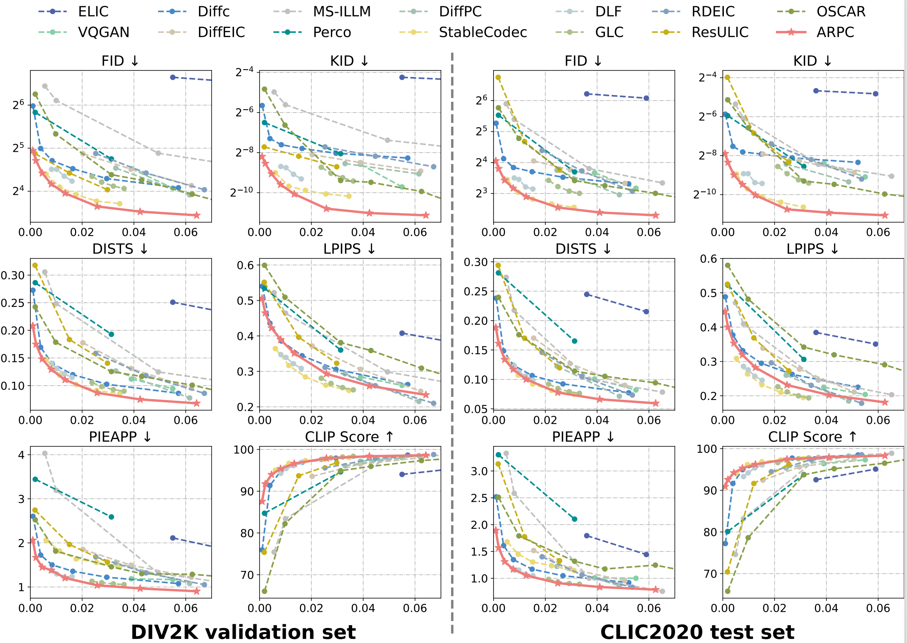
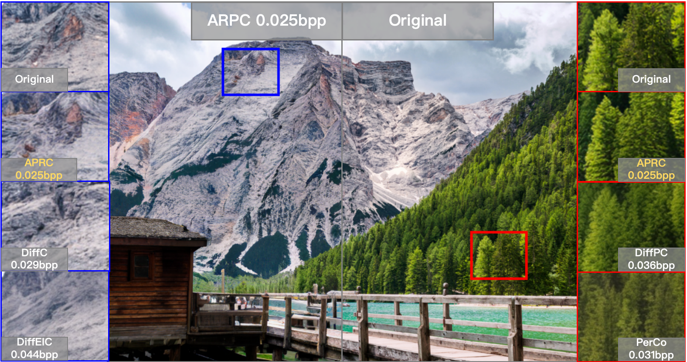
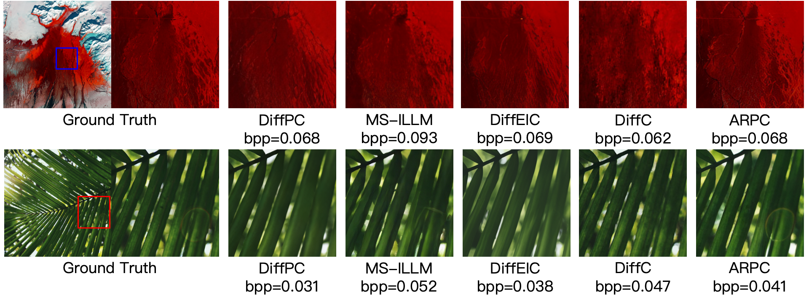

# Autoregressive-based Progressive Coding for Ultra-Low Bitrate Image Compression

### ⏰Todo

---

- [x]  Repo release
- [ ]  Update paper link
- [x]  Pretrained models
- [x]  Inference
- [ ]  Training

### 📖Abstract

---

Generative models have demonstrated significant results in ultra-low bitrate image compression, owing to their powerful capabilities for content generation and texture completion. Existing works primarily based on diffusion models still face challenges such as limited bitrate adaptability and high computational complexity for encoding and decoding. Inspired by the success of Visual AutoRegressive model (VAR), we introduce AutoRegressive-based Progressive Coding (**ARPC**) for ultra-low bitrate image compression, a progressive image compression framework based on next-scale prediction visual autoregressive model. Based on multi-scale residual vector quantizer, ARPC efficiently encodes the image into multi-scale discrete token maps and controls the bitrates by selecting different scales for transmission. For decompression, ARPC leverages the prior knowledge inherent in the visual autoregressive model to predict the unreceived scales, which is naturally the autoregressive generation process. To further increase the compression ratio, we target the VAR as a probability estimator for lossless entropy coding and propose group-masked bitwise multi-scale residual quantizer to adaptively allocate bits for different scales. Extensive experiments show that ARPC achieves state-of-the-art perceptual fidelity at ultra-low bitrates and high decompression efficiency compared with existing diffusion-based methods.

### ✅Main results

---

**Rate-distortion-perception comparison on benchmarks:**



**Visual results:**





### ⚙️**Installation**

---

```bash
conda env create -f environment.yaml
conda activate ARPC
```

### 💡Data Preparation

---

**Training data**

We use [Coyo-700M](https://github.com/kakaobrain/coyo-dataset) as our training data. We first select images with a resolution greater than $1024 \times 1024$, and then exploit an OCR model to filter undesired images with too much text. We utilize the [InternVL 2.0 model](https://huggingface.co/OpenGVLab/InternVL2-8B) to re-caption all filtered images to provide more accurate and detailed annotations. Our final training dataset includes 5M highly curated images with detailed captions.

The dataset file structure as follow:

```bash
<PATH_TO_DATASETS>/id.JPEG
```

We prepare the .jsonl  file for training with each json item containing the following information:

```json
{
	"id":"id",
	"long_caption": "detailed caption",
	"long_caption_type":"caption-InternVL2.0",
	"text": "short caption"
}
```

**Test data**

In our paper, we adopt [Kodak](https://r0k.us/graphics/kodak/), [DIV2K Validation Set](https://data.vision.ee.ethz.ch/cvl/DIV2K/), and [CLIC2020 Test Set](https://archive.compression.cc/challenge/) for evaluation.

We use [BLIP](https://github.com/salesforce/BLIP) model to generate the image captions. 

We give an example with DIV2K dataset in `data/DIV2K.json` .

### 🔥Train

---

**Stage1:** 

We train the image encoder and decoder with the group-masked bitwise multi-scale residual quantizer.

**Stage2:**

We use Infinity-2B as the visual autoregressive model, and finetune it for 20k iterations.

Download the [Infinity-2B pretrained model](https://huggingface.co/FoundationVision/infinity/blob/main/infinity_2b_reg.pth) and [flan-t5-xl](https://huggingface.co/google/flan-t5-xl) and save in `weights/` .

```bash
bash train.sh
```

### ⏭️Inference

---

Download pretrained models and save in `weights/` :

1. Download the image encoder, decoder and GM-BMSRQ: [checkpoint](https://drive.google.com/file/d/1-uwyu_7ZeCZfaRF4rv4gBbhSZmfY0geN/view?usp=share_link).
2. Download the visual autoregressive model: [checkpoint](https://drive.google.com/file/d/1i-cjvBlKQoHA_lkj_G-Iv7s1j4l6QHR4/view?usp=share_link).

```bash
python demo.py
```